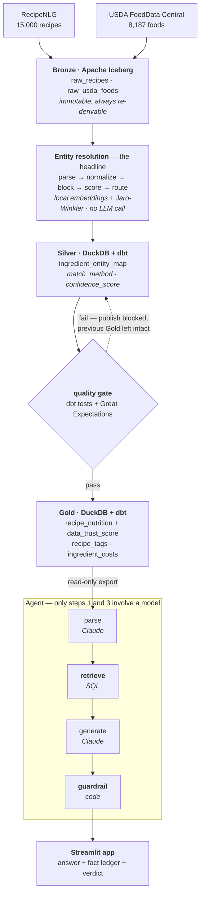
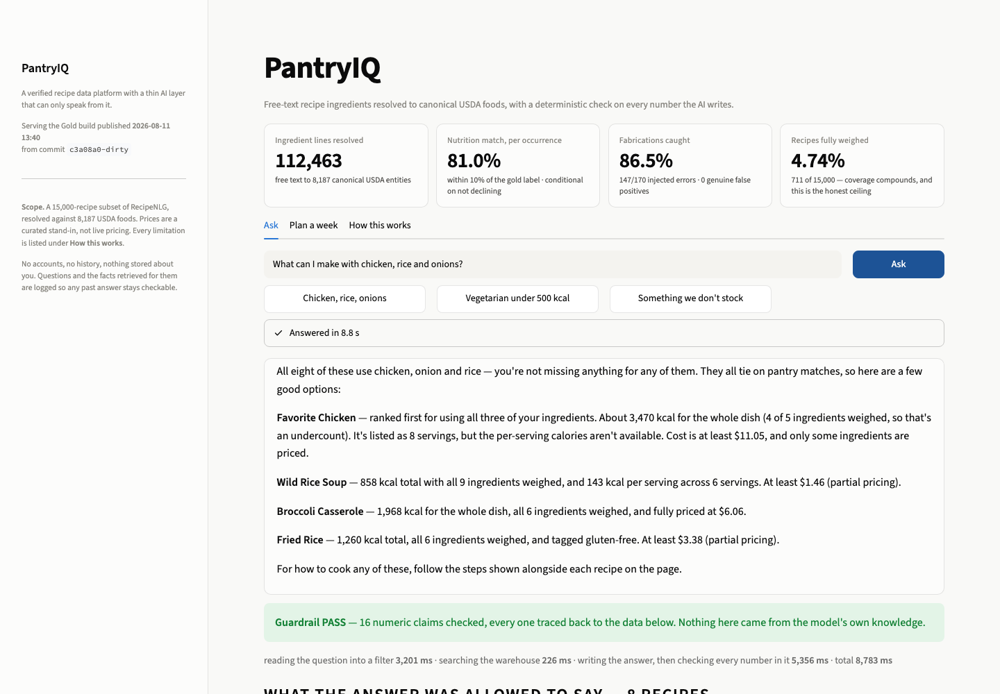
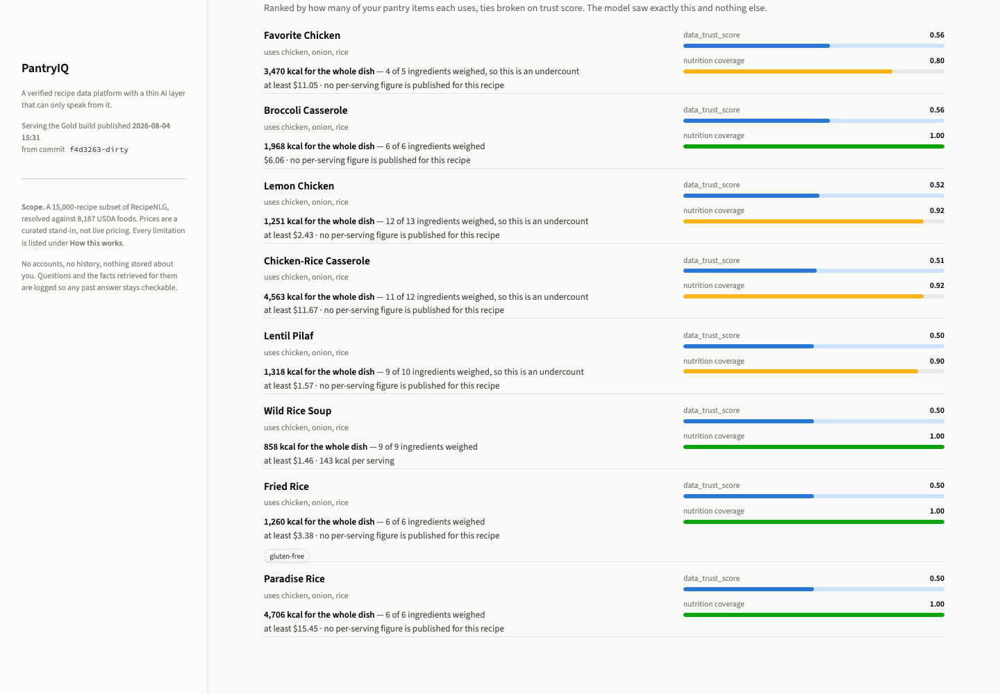

# PantryIQ

A verified recipe data platform with a data-grounded AI layer. The headline is **entity
resolution**: free-text recipe ingredients resolved to canonical USDA food entities with
measured precision/recall — so the AI layer can only speak from verified nutrition, cost, and
ingredient data, with a deterministic check on every numeric claim it makes.

- **📖 Start here — the project journal, in plain language:** [`docs/PROJECT_JOURNAL.md`](docs/PROJECT_JOURNAL.md)
- **Operating brief (locked decisions, phase gates):** [`docs/PantryIQ_Master_Prompt.md`](docs/PantryIQ_Master_Prompt.md)
- **Full design:** [`docs/PantryIQ_Design_Doc.md`](docs/PantryIQ_Design_Doc.md)

## Results

All **9,163 distinct ingredient strings** have an entity-map row in
`silver.ingredient_entity_map`, covering 112,452 of the corpus's 112,463 ingredient lines. The
resolver **commits to a USDA entity for 6,279 of them (68.5%) and declines on 2,884 (31.5%)**;
8,949 strings (97.7%) carry an energy value.

| Headline — stratified over the corpus, **among the 68.5% of strings the resolver does not decline** | per unique string | per occurrence |
|---|---|---|
| **nutrition within 10%, or within 5 kcal/100g, of the gold label** | 69.3% [60.2, 78.1] | **81.0%** [69.3, 88.0] |
| entity top-1 | 47.7% [37.9, 57.6] | 67.3% [49.5, 78.5] |

The per-occurrence column is the one that describes the product: head strings are 5.9% of the
vocabulary but 83.8% of what a user actually hits. Accuracy is **conditional on not declining** —
the resolver abstains on 12.5% of occurrences rather than guessing, and accuracy and coverage move
in opposite directions by construction, so neither figure is quotable alone.

The metric's name is literal: a pick counts as equivalent if it is within 10% **or** within
5 kcal/100g of the gold label. That absolute floor stops near-zero foods (brewed tea, 0 vs
1 kcal/100g) from registering as 100% errors, and it is worth +2.7pp per string / +0.5pp per
occurrence — reported rather than folded in:

| floor | per unique string | per occurrence |
|---|---|---|
| 5 kcal (shipped) | 69.2% | 77.4% |
| 2 kcal | 67.8% | 77.0% |
| none (pure relative error) | 66.5% | 76.9% |

Both figures are estimates of agreement with the gold labels — see the caveat below.

Three results that shaped the build, each measured rather than assumed:

- **There is a ceiling this pipeline cannot pass, and it is in the data, not the model.** The
  median kcal spread *within the correct food* is ~32% — `pinto bean` spans 82 kcal/100g canned
  to 333 dry, and the recipe line never says which. A perfect resolver is still that far off.
- **The machine learning earned nothing.** Eight engineered features, a calibrated logistic model
  and isotonic routing gained on the tuning split and lost on the frozen holdout — the direction
  flipped, which is what noise does. On the holdout the learned scorer is −2.5pp on entity
  (p=0.75) and exactly level on nutrition (5 wins each, p=1.00) against plain top-cosine. What
  ships is the top embedding cosine plus a stored confidence curve.
- **Label quality is measured, not asserted.** Three independent LLM annotators over 120 strings
  give **Krippendorff's α = 0.721 [0.651, 0.787]** — consistent with the usable band but not
  clearly above the ~0.67 floor, so the interval is what gets quoted, never the point estimate.
  An ensemble could not improve the existing labels, so they were left in place.
- **The resolver declines rather than guessing.** Some ingredient strings have no USDA entity at
  all — 12.0% of the gold sample, which reweights to 15.3% per unique string but only 3.8% per
  occurrence. A threshold fitted for that (not reused from the confidence curve) catches ~62% of
  them, because a wrong match silently produces wrong nutrition where an honest gap does not.

**No resolution calls an LLM.** Every one of the 9,163 strings is resolved by local embeddings
plus a stored confidence curve — the shipped pipeline makes **zero** model calls to match an
ingredient. That reads like a cost win and is really a measurement result, so it is reported the
honest way round: §2.6's Claude adjudicator was **investigated and not built**, because its
accuracy cannot be honestly scored against an LLM-produced gold set
([§10](docs/er_metrics.md)). The calibrated confidence "cannot certify correctness; it can flag
likely-wrong picks", so there is no confident subset to skip adjudication *on* —
[§7](docs/er_metrics.md) concludes the adjudicator is "required, not an optimization". The 0% is
what shipped, not what the design wanted.

**Everything here is measured on the ~15,000-recipe subset.** The brief's §4 anticipated scaling
to 100–500K once the ER metrics were green; that gate was never taken. Every figure on this page
is a subset figure.

> ⚠️ 282 of the 300 gold labels were produced by an LLM annotator rather than a human. Every
> number on this page — including `recall@50` below — measures agreement with those labels, not
> with ground truth. Read [`docs/er_metrics.md`](docs/er_metrics.md) before quoting any of them —
> it also records the measurements that failed, and why.

## Status

**Phase 1 complete** — Bronze landed and DuckDB-verified: `bronze.raw_recipes` (15,000
RecipeNLG rows, the subset-first sample) and `bronze.raw_usda_foods` (8,187 USDA Foundation +
SR Legacy foods).

**Phase 2 complete** (Silver + entity resolution — the headline): 112,463 ingredient lines parsed
to 9,163 distinct strings, 8,187 canonical USDA entities, a 300-row stratified gold set,
candidate generation at recall@50 = 90.5%, a shipped resolver, and the entity map above. 2.6's
Claude adjudicator was **investigated and not built** — its accuracy turns out to be structurally
unmeasurable against an LLM-labeled gold set (§10).

**Phase 3 complete** — Bronze USDA portions, gram conversion, a dbt Gold layer, the cost table,
a write-audit-publish gate and the Airflow DAG:
63.9% of ingredient lines convert to a mass, and `gold.recipe_nutrition` carries per-recipe and
per-100g nutrition with `nutrition_coverage` and `data_trust_score`. Two findings worth reading
before quoting anything from Gold ([§14](docs/er_metrics.md)):

- **Gram conversion is 77.6% accurate** against published reference weights, measured on the
  reference pairs no hand-correction touched. The headline figure over *all* pairs is 83.2%, but
  11 of 34 sit on hand-overridden entities, so 77.6% is the number that stands on its own.
- **13 head-string entity errors were hand-corrected** — `sugar` resolved to *powdered* sugar
  (110 g/cup against 200), `egg` to **Eggnog** on 4,399 lines, `milk` to **Crackers, milk**. The
  kcal headline was structurally blind to these: powdered and granulated sugar carry
  near-identical energy. The corrections are **asserted, not measured** — their independent
  effect on every metric is +0.0pp, because the only two that the gold set can see were set to
  exactly their gold label. They were kept because they are wrong on inspection, not because a
  number improved. See §14.
- **Only 4.7% of recipes have complete nutrition.** Per-line coverage is 63.9%, but a recipe needs
  every line, so completeness compounds. Nothing quotes a recipe total without its coverage.

**Phase 4 complete** — the agent: `parse` (Claude, into a fixed filter schema) → `retrieve`
(SQL, no model) → `generate` (Claude, shown only what retrieval returned) → `guardrail`
(deterministic code). Retrieval sits outside the model's control on purpose; that is what makes
"it can only speak from verified data" checkable rather than aspirational. Read
[§15](docs/er_metrics.md) before quoting any of it:

- **The guardrail catches 147/170 injected fabrications (86.5%, Wilson 80.5–90.8%) across nine
  error classes, with 0 genuine false positives on 20 unmodified answers.** Misattribution and
  division-by-servings are both caught 100%. A previous version of this line claimed 36/36 =
  100%; that figure was a **tautology** — the harness discarded an injection using the same
  predicate it then used to decide the injection was caught, so it could only ever print 100%.
  On the honest denominator the old rule caught **40%**. See [§16](docs/er_metrics.md).
- **Latency misses the <5s target**: 5.3s median to first token (p90 8.2s), 7–12s to a complete
  answer. Both model calls already run at minimum effort with thinking off; retrieval itself is
  15–38ms. Streaming took the perceived wait from 13.4s to 5.3s.
- **The dietary tags are decided per entity, by classifying all 8,187 USDA foods** for
  vegetarian / vegan / gluten-free / unknown into `silver.entity_dietary_flags`; a tag requires
  *every* ingredient to qualify, and `unknown` disqualifies. Two earlier rules — a name denylist,
  then a food-group allowlist — both failed the same way, because both were proxies for a
  property of the food. The allowlist still left **30/572 vegetarian (5.2%) and 16/134 vegan
  (11.9%)** falsely tagged by entity inspection, six and four times the published figure; two
  recipes tagged *vegan* were a ribs recipe and a cocktail-wieners recipe. Counts are now
  vegetarian **418**, vegan **61**, gluten-free **179**, with 0 flesh-group entities and 0
  non-qualifying entities inside any tagged recipe.

- **The dietary safety assertions run inside the gate**, as dbt tests, so a false tag blocks the
  publish. Watched blocking: with the safeguards removed they fail on 371 and 83 rows and
  `dbt build` errors. They previously lived only in pytest, where three mutations to
  `recipe_tags.sql` — including adding `'Beef Products'` to the vegetarian allowlist — left all
  520 Python tests green.
- **`nutrition_coverage = 1.0` does not mean the ingredient list is complete.** The corpus ships
  truncated recipes — "Pickled Bologna" lists vinegar, sugar, salt and pickling spice and no
  bologna. The pipeline is faithful; the source is short. A directions-based veto now blocks a
  tag when the method names a food the ingredients do not.

- **The quality explainer drafts runbook entries** for failed dbt tests and low-confidence
  resolutions, guardrailed the same way — a rejected draft degrades to the facts rather than
  being published. Proven against a real captured dbt failure (1 failing row, 17 downstream
  models skipped), not a hand-written one.

- **The test suite is mutation-swept, and the sweeps keep finding that the tests were the
  problem.** Three sweeps so far; two had harness bugs that made them report success
  unconditionally, both caught by insisting on a passing control. Eight tests have been found
  that named a property they could not actually fail on. 624 tests, 612 of which run without the
  corpus.

**Phase 5 in progress** — the web app is built and the serving layer is packaged; the deployment
is not done yet, so there is no live URL to link. The app runs locally (see
[Running the app](#running-the-app)) and reads the same read-only Gold artifact a container would
ship. Two findings so far:

- **The serving image needs almost none of the pipeline.** The agent package imports exactly three
  third-party names, so `[project.dependencies]` is now the serving set alone and everything the
  batch pipeline needs sits in a `pipeline` dependency group. A serving install is **357 MB against
  1.5 GB**; `sentence-transformers` alone drags in 502 MB of torch that the read path never loads.
- **Two display bugs that only a screenshot could find.** `st.table` routes through pandas into
  pyarrow and **segfaulted** — a hard crash, not an exception, so no error boundary would have
  caught it in production. And Streamlit's markdown reads `$…$` as LaTeX, so two dollar amounts in
  one paragraph rendered as a serif formula and the amounts vanished. Cost is the figure this app
  quotes most; the pairing was invisible until a paragraph happened to contain two of them.

(`foodPortions.gramWeight` is absent from the abridged `/foods/list` payload in Bronze, but
`POST /v1/foods` with `format=full` serves it in ~410 requests — no bulk download needed. USDA's
`foodCategory` needs its own pass over the same ids, because the portions cache kept only
`fdcId` and `foodPortions`.)

## Architecture



Airflow orchestrates every arrow up to the export. **The batch pipeline, Airflow and the Iceberg
catalog run locally by design** — only the app and a read-only copy of Gold are meant to be
deployed. The quality gate is not decorative: `make prove-gate` injects a 50,000 kcal/100g row and
asserts that the publish is blocked and `gold.*` is left byte-identical.

## Running the app

```bash
make gold                                        # build data/pantryiq_gold.duckdb (needs the corpus)
uv run streamlit run src/pantryiq/serving/app.py # → http://localhost:8501
```

Needs `ANTHROPIC_API_KEY` in `.env`. If either the Gold file or the key is missing, the app says
which rather than failing somewhere inside DuckDB. `PANTRYIQ_GOLD_DB` and `PANTRYIQ_LOG_DB`
override where it reads and writes.



Every answer ships with the ledger of facts it was allowed to draw on — coverage, cost floor,
dietary tags and `data_trust_score` per recipe — and a deterministic verdict on every number in it:



### Asking it something

```bash
uv run python -m pantryiq.agent "what can I make with chicken, rice and onions?"
uv run python -m pantryiq.agent.planner        # a week's plan, solved in code
uv run python scripts/measure_guardrail.py     # catch rate + false-positive rate
uv run python -m pantryiq.agent.explain        # runbook entries for failures + low-confidence
```

- Measured results, including the negative ones: [`docs/er_metrics.md`](docs/er_metrics.md)
- Labeling convention: [`docs/labeling_guide.md`](docs/labeling_guide.md)
- Session logs + decisions: [`docs/session_2026-08-04.md`](docs/session_2026-08-04.md) (all of Phase 4 + its review) · [`docs/session_2026-07-31.md`](docs/session_2026-07-31.md) (Phase 2 review + all of Phase 3) · [`docs/session_2026-07-24.md`](docs/session_2026-07-24.md)

### Reproducing the entity resolution

```
uv run python -m pantryiq.silver.ingredient_lines   # -> silver.recipe_ingredient_lines
uv run python -m pantryiq.silver.usda_foods         # -> silver.usda_foods
uv run python -m pantryiq.er.candidates             # -> silver.ingredient_candidates
uv run python -m pantryiq.er.resolve                # fit the confidence curve
uv run python -m pantryiq.er.abstain                # fit the no-match threshold
uv run python -m pantryiq.er.entity_map             # -> silver.ingredient_entity_map + headline
```

## Setup

Requires [uv](https://docs.astral.sh/uv/).

```
make setup   # create the venv (Python 3.11) and install dev deps
make test    # run tests
make lint    # ruff check
```

Copy `.env.example` to `.env` and fill in keys.

## Data

Datasets are gitignored (large). To reproduce Phase 1:

- **RecipeNLG** (~2.2M recipes, ~2.3 GB) — download `full_dataset.csv` from
  <https://recipenlg.cs.put.poznan.pl/> (accept the terms form), place it at
  `data/raw/recipenlg/full_dataset.csv`, then sanity-check:
  `uv run python scripts/inspect_recipenlg.py`.
- **USDA FoodData Central** — free API key from
  <https://fdc.nal.usda.gov/api-key-signup.html> → put in `.env` as `USDA_API_KEY`.

### Regenerating Bronze

```
uv run python -m pantryiq.ingestion.recipes   # -> bronze.raw_recipes    (15,000 rows)
uv run python -m pantryiq.ingestion.usda      # -> bronze.raw_usda_foods (8,187 rows)
```

Both are idempotent (each re-run overwrites its table; a 0-row result is refused rather than
silently wiping the table). The USDA counts are a **live** pull from 2026-07-22 — Foundation
grows over time, so a later pull may exceed 394 Foundation / 7,793 SR Legacy. The lakehouse
lives in `data/lakehouse/` (gitignored); delete that directory for a clean regeneration.
